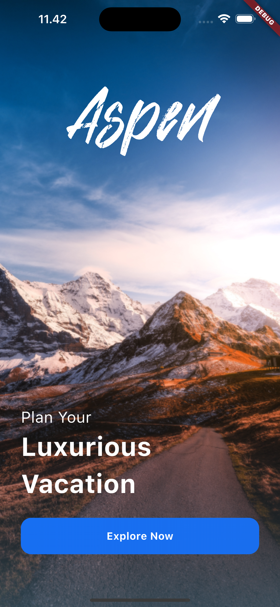
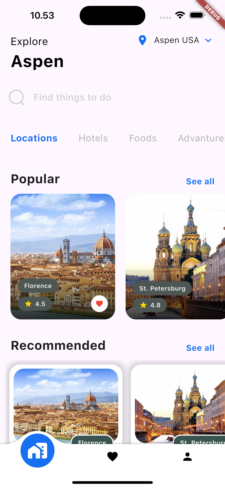

# UI Travel APP

## Description

This is a travel app that allows users to enter a destination and a departure date and get back weather information and an image of the location. The app also allows users to save their trips and view them later.

## Special Thanks
This UI App is inspired by [Aspen Travel App Exploration- Mobile App Design](https://www.figma.com/community/file/1091615514005406765/aspen-travel-app-exploration-mobile-app-design) design by [Nickelfox Design](https://www.figma.com/@Nickelfox)

 

## Documentation

## Screenshots

|  |  |  |
| :--------------------------------------------------: | :--------------------------------------------------: | :--------------------------------------------------: |
|                 Splash Screen                |                 Home Screen              |                Detail Screen                 |


## Getting Started

To get started with the Shop App, follow these steps:

1. **Clone the repository:**

   ```bash
   git clone https://github.com/emRival/ui_travel_app.git
   ```

2. **Clone the repository:**
   ```bash
   cd shop-app
   ```
3. **Install dependencies:**
   ```bash
   flutter pub get
   ```
4. **Run The App:**
   ```bash
   flutter run
   ```
